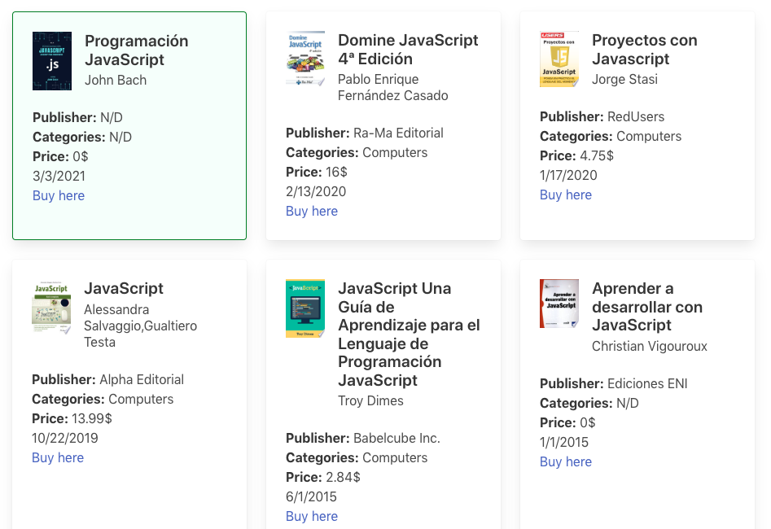

# Assestment

Follow the next tasks in order to develop a basic book list using vanilla javascript.

## Task/exercises for candidates as frontend developers.
1.- Using public Google Books API `httpps://www.googleapis.com/books/v1/volumes?q=javascript` (No API key necessary) do the next:
- Before executing the request, you must create a new Book object constructor, which contains properties for: **title, authors, publishedDate, publisher and categories**.
- Iterate through the response content and create Book object instances that you prepared in previous step, with available values for each found book and store them in a new Array.
- Output all books to the Javascript console formated like **title, authors, publishDate, publisher, [category1, category2, …]**

```
V.g. Javascript: The definitive guide (Activate your Web
Pages), David Flanagan, 2011-04-18, “O’Reilly Media, Inc.”,
[Computers]
```
Consider adding appropriate method to the object constructor to create a formated
string.
- Do the following tasks:
    - Sort the Array created in 1) by publishedDate and output in console.
    - Calculate and output the average rating of the “Computers” books.
- Do the following tasks:
    - Extend the basic Book object and create a new AvailableBook object constructor that inherits all basic book properties and adds 2 new properties for listPrice (listPrice.amount) and buyLink.
    - Every AvailableBook instance show now have 2 additional methods: getPrice() and getBuyLink() that returns the price and the link respectively. Also overwrite the toString() method for an extended formated representation of an AvailableBook instance by adding the additional properties:
```
V.g. … - 43.56€ at
https://play.google.com/store/books/details?id=6TA0DdEIxrgC
&rdidi=book-6TAODdEIxrgC&rdot=1&source=gbs_api
```

- Create a simple HTML page to display the books in a list using standard DOM manipulation
operations.
- Encapsulate both new object constructors into a namespace structure using a simple
modularization approach.


## How to run the project

Clone the repository:

```shell
git clone https://github.com/christianjtr/<NAME>.git
```


Noticed you will need a `live server` to launch the project.

**Alternatives**

- [VSCODE Live Server](https://marketplace.visualstudio.com/items?itemName=ritwickdey.LiveServer)
- [npm live-server](https://www.npmjs.com/package/live-server)


## Result

Basic layout with the sample result.



## Technologies

Vanilla Javascript, CSS, Bulma CSS.
